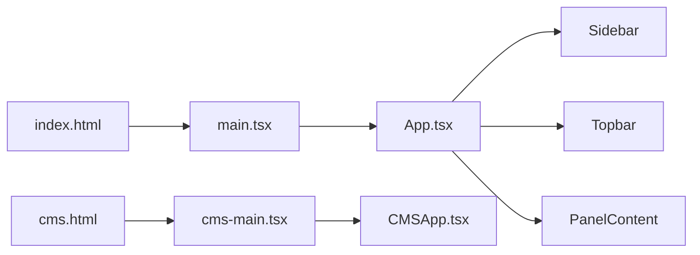

# NSK 后台（C-Lingo AIOS）工程结构与运行逻辑

本文档与当前代码一致，便于开发快速了解后台运行方式。侧栏以 [`src/components/Sidebar.tsx`](../src/components/Sidebar.tsx) 为准。

## 1. 技术栈与构建

| 项 | 说明 |
| --- | --- |
| 运行时 | React 18、TypeScript 5.6 |
| 构建 | Vite 6（[`vite.config.ts`](../vite.config.ts)：`@` → `/src` 别名；`LAN=1` 时 dev/preview 监听 `0.0.0.0`，便于局域网调试） |
| 路由 | 依赖中有 `react-router-dom`，但主应用 **未使用 URL 路由**；页面切换靠 React 状态 `PanelId` |
| 后端 | **无内置 HTTP API 层**：业务为前端配置台，持久化以 **localStorage** 为主 |

构建入口（`vite.config.ts` 的 `build.rollupOptions.input`）：

- [`index.html`](../index.html) → [`src/main.tsx`](../src/main.tsx) → [`src/App.tsx`](../src/App.tsx)：**当前主后台**
- [`cms.html`](../cms.html) → [`src/cms-main.tsx`](../src/cms-main.tsx) → [`src/CMSApp.tsx`](../src/CMSApp.tsx)：**独立 CMS 壳**（与主后台并行；数据多为 [`cms-data.ts`](../src/cms-data.ts) 内联/演示）

---

## 2. 主应用运行逻辑

### 2.1 根组件 [`App.tsx`](../src/App.tsx)

- 状态 `activePanel: PanelId`，默认 `'dashboard'`
- 状态 `activeCourseLibId`：当前选中的**课程库**，来自 [`stores/courseLibs.ts`](../src/stores/courseLibs.ts) 的 `loadCourseLibs()`
- 监听 `COURSE_LIBS_UPDATED_EVENT`：课程库列表变化时校正当前选中 ID

布局：**Sidebar（左） + main（Topbar + content）**，content 内只渲染一个 `page active` 包裹的 [`PanelContent`](../src/panels/index.tsx)。

### 2.2 导航与页面注册

- **侧栏**：[`Sidebar.tsx`](../src/components/Sidebar.tsx) — 点击项调用 `onNavigate(PanelId)`；含「管理员 / 课研」角色切换（**仅课研时隐藏「系统管理」区块**）
- **顶栏面包屑**：[`Topbar.tsx`](../src/components/Topbar.tsx) — 产品名 + `NAV_LABELS[panelId]`（定义于 [`types.ts`](../src/types.ts)）
- **中央内容**：[`panels/index.tsx`](../src/panels/index.tsx) 中 `PANELS: Record<PanelId, ...>` 将每个 `PanelId` 映射到对应面板组件

**扩展新页面**：在 [`types.ts`](../src/types.ts) 增加 `PanelId` 与 `NAV_LABELS`，在 `PANELS` 注册组件，并在 `Sidebar` 增加入口（若需展示）。

### 2.3 业务模块分层

| 路径 | 职责 |
| --- | --- |
| [`src/panels/*.tsx`](../src/panels) | 各功能页（大表单、表格、弹窗） |
| [`src/components/*.tsx`](../src/components) | 侧栏、顶栏、通用小组件 |
| [`src/stores/*.ts`](../src/stores) | 跨页面共享：localStorage 读写、规范化、`CustomEvent` 广播 |
| [`src/types.ts`](../src/types.ts) | `PanelId`、导航文案 |

典型 **stores** 模式：`STORAGE_KEY` + `loadX()` / `saveX()`，更新后 `dispatchEvent(CustomEvent(...))`，`App` / `Sidebar` 等订阅同步 UI。

---

## 3. 侧栏菜单与 PanelId 对照（源码核对）

以下与 [`Sidebar.tsx`](../src/components/Sidebar.tsx) 一致。

| 侧栏区块 | 菜单项 | `PanelId` |
| --- | --- | --- |
| 概览 | 数据仪表盘 | `dashboard` |
| 概览 | 课程库配置 | `course-config` |
| 课程库（选中某库后展开，子项受该库 `modules` 开关控制） | 目录管理 | `catalog` |
| | 学习资源 | `resources` |
| | 有声阅读配置 | `audio-reading` |
| | 题库管理 | `questions` |
| | 资源库 | `medialib` |
| | 课程AI配置 | `ai-capabilities` |
| AI 配置 | AI 角色配置 | `ai-roles` |
| | 自由对话训练 | `ai-free` |
| | 场景训练管理 | `ai-scene` |
| 内容运营 | 文化内容 | `culture` |
| | 图书馆管理 | `library` |
| | HSK 考试配置 | `hsk` |
| 用户 & 运营 | 用户管理 | `users` |
| | Premium 管理 | `premium` |
| | 通知推送 | `notify` |
| 系统管理（仅管理员角色） | 题型模板配置 | `qtype` |
| | 操作日志 | `logs` |
| | 系统设置 | `sysconfig` |

### 已注册但未在侧栏展示的 PanelId

| `PanelId` | 说明 |
| --- | --- |
| `ai-eval` | 发音评测设置，[`panels/index.tsx`](../src/panels/index.tsx) 映射到 `AiTrainerSync`，与 `ai-api` 当前参数相同 |
| `ai-api` | API 集成配置，同上 |
| `multilang` | 多语言译文（[`types.ts`](../src/types.ts) 注释：侧栏已去掉，翻译并入其他模块） |
| `vocab` | 词汇/语法库（保留路由，侧栏不展示） |

可通过代码内 `onNavigate('…')` 或后续补入口访问上述页面。

---

## 4. 功能域心智模型（与 `types.ts` 注释一致）

- **概览**：Dashboard、课程库配置
- **NSK 体系课程目录**：目录、学习资源、有声阅读、题库、资源库、课程 AI（按课程库模块开关）
- **AI 配置**：AI 角色、自由对话、场景训练；发音评测/API 为保留 PanelId
- **内容运营**：文化、图书馆、HSK
- **用户与运营**：用户、Premium、通知
- **系统**：题型模板、日志、系统设置（管理员）

---

## 5. 第二入口 CMS（`cms.html`）

[`CMSApp.tsx`](../src/CMSApp.tsx) 为另一套页面状态（`catalog | resources | …`），使用 [`cms-data.ts`](../src/cms-data.ts)、[`CMSPages.tsx`](../src/CMSPages.tsx)、[`CMSModals.tsx`](../src/CMSModals.tsx)。与主后台 **不共享** `App` / `PanelContent`。

**日常改「统一后台」以 `index.html` + `App.tsx` + `panels/` 为准**；仅维护 CMS 演示页时再看 `cms.html` 链路。

---

## 6. 协作约定

1. **无服务端**：配置即前端 JSON + localStorage；对接真实 API 需另起集成层。
2. **页面切换**：`PanelId` 状态，非 URL；刷新会回到默认页（除非自行持久化或接入路由）。
3. **数据一致性**：改 stores 时发事件或写同一 key；多 Tab 可部分依赖 `storage` 事件。
4. **双应用**：构建含两个 HTML，部署时确认暴露入口或做跳转说明。

---

## 7. localStorage 键对照表

以下为当前 `src/` 内使用 `localStorage` 的键（新增 key 时请同步更新本表）。

| 键 | 用途/数据 | 主要位置 |
| --- | --- | --- |
| `nsk-course-libs-v1` | 课程库列表与模块开关 | [`stores/courseLibs.ts`](../src/stores/courseLibs.ts) |
| `nsk-ai-capabilities-v1` | 课程 AI 能力行数据 | [`stores/aiCapabilities.ts`](../src/stores/aiCapabilities.ts) |
| `nsk-ai-roles-v2` | AI 角色配置列表 | [`panels/AiRoles.tsx`](../src/panels/AiRoles.tsx) |
| `nsk-ai-category-i18n` | 主题分类多语言（课程 AI / 自由对话共用） | [`panels/AiCapabilities.tsx`](../src/panels/AiCapabilities.tsx)、[`panels/AiFree.tsx`](../src/panels/AiFree.tsx) |
| `nsk-question-overrides-v1` | 题目覆盖数据 | [`stores/questionOverrides.ts`](../src/stores/questionOverrides.ts) |
| `nsk-audio-reading-lines-v3` | 有声阅读行配置 | [`panels/AudioReading.tsx`](../src/panels/AudioReading.tsx) |

说明：`AiScene.tsx` 等仅 **读取** `nsk-ai-roles-v2` 拉取角色选项，不写回该键。

---

## 8. 维护

- 修改侧栏或 `PanelId` 时，请同步更新 **第 3 节** 表格。
- 新增 `localStorage` 键时，请同步更新 **第 7 节** 表格。
